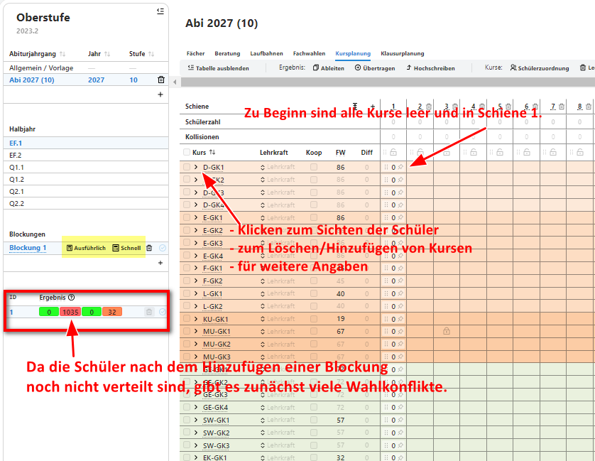
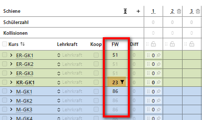
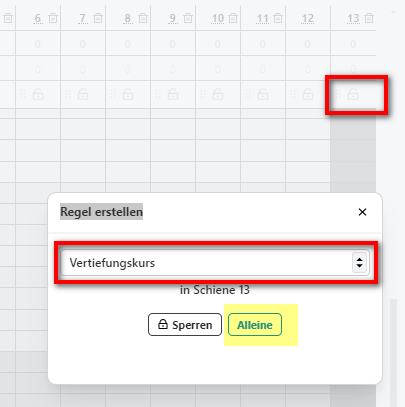

# Blockung der Jahrgangsstufe 10
Für die folgenden Aufgaben können Sie die Datenbank 1_Jg10Planung_ohneWahlen.sqlite aus dem Ordner !!! nutzen.   

Um den jetzigen Jahrgang 10 für das kommende Schuljahr (dann EF) zu planen, sollen die Laufbahndaten erhoben werden und eine Blockung vorbereitet werden.   

### Abiturjahrgang erstellen
Legen Sie für die Jahrgangsstufe 10 unter Oberstufe einen neuen Abiturjahrgang an. Die Standard-Einstellungen für die Fächerwahl in der Oberstufe werden aus der Vorlage übernommen und müssen somit nicht weiter angepasst werden. 

Pflegen Sie folgende Angaben dem Abiturjahrgang hinzu:
* Karin Link und Tom Bockemüller sind Beratungslehrer der kommenden EF.
* Die Abgabe der Wahlbögen wird auf den 05.04. diesen Jahres terminiert.

### Fachwahlen
**a. Wahlen im Client durchführen**  
Führen Sie mit Diana Büttner gemeinsam eine Laufbahnplanung im SVWS-Client durch.

**b. Wahlbogen manuell ausfüllen**  
Robert Kurz und Jana Holten möchten ihren Wahlbogen schriftlich ausfüllen. Drucken Sie ein entsprechende Vorlage.

**c. Laufbahndateien exportieren/importieren**  
Für die nachfolgenden Teilaufgaben finden Sie [hier](https://help.svws-nrw.de/gost/laufbahn/) Hilfe.
* Exportieren Sie für alle Schüler der Jahrgangsstufe 10 die Laufbahndateien, sodass diese mit dem WebLuPO ihre Wahlen vom Rechner aus durchführen können.
* Pflegen Sie über den LuPO-Client die Laufbahndaten von Sarah Blavin ein. Nutzen Sie dazu folgenden Link: https://laufbahnplanung.svws-nrw.de/#/load
* Importieren Sie die Laufbahndaten von Sarah in die Datenbank.
* Importieren Sie die Wahlen aller Schülerinnen und Schüler aus der Jahrgangsstufe 10. Die fertigen Wahlen finden Sie im Ordner Laufbahnwahlen_4_fobi_JG10_NachWahlen

### Beratung der Schüler
Nach Absprache mit der Schulleitung soll der Projektkurs Medizintechnik nicht angeboten werden. Beraten Sie die SchülerInnen entsprechend und nehmen Sie Umwahlen vor.

### Drucken der Laufbahnen
Drucken Sie die Laufbahnwahlen
* für die Schulleitung und 
* für jeden Schüler einzeln.

### Blocken der Laufbahndaten
Sichten Sie die Fachbwahlmatrix und entscheiden Sie, ob alle Kurse der Wahl entsprechend zustanden kommen.

### Kursplanung
Für die nachfolgenden Aufgabenteile findet man [hier](https://hilfe.svws-nrw.de/gost/kursplanung/) eine Anleitung
1. Legen Sie eine neue Kursblockung "Blockung EF.1 - Datum" für das Halbjahr EF.1 an.
2. In der Blockung finden Sie drei evangelische Religionskurse. Reduzieren Sie die Anzahl auf zwei.
3. Drucken Sie eine Liste aller Schülerinnen und Schüler, die Latein in der EF.1 gewählt haben.
4. Der Vertiefungskurs soll alleine in Schiene 13 gelegt werden.
5. Da es nur einen Chemiekollegen für die Oberstufe gibt, müssen die Chemiekurse in unterschiedlichen Schienen liegen.

Hinweise:   
**Zu 1:**
Nach Anlegen einer Blockung sieht diese zunächst so aus:   
   

**Zu 2:** 
Nach einem Klick auf den Kurs erscheint u.a. ein Löschbutton
   

**Zu 3:**
Durch Klick auf die Fachwahlen erscheinen recht alls Schülerinnen und Schüler, die dieses Fach gewählt haben.
   

**Zu 4:**
Eine Möglichkeit:
   

**Zu 5:**
Öffnen Sie die Detailansicht für die Festlegung von weiteren Regeln:
 

### Installation Starten
Führen Sie die Installation als Administrator aus!

> [!TIP] 
> Eine gute Anleitung finden Sie auch im [Wiki](https://schulverwaltungsinfos.nrw.de/svws/wiki/index.php?title=Installation_SVWS-Server_und_SchILD-NRW_3#Installation_des_SVWS-Servers)

