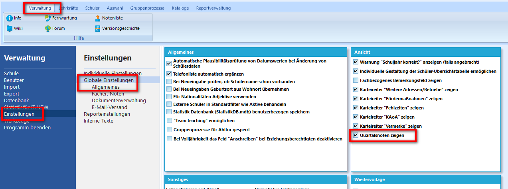

# Leistungsdaten in schild3
Eine der größten Änderungen in diesem Bereich ist die Umstellung auf den Halbjahresbetrieb an Gesamtschulen. Diese Anpassung betrifft nur Gesamtschulen, die bisher im Quartalsmodus gearbeitet haben.

## Quartale
Auch wenn die Quartale abgeschafft wurden, sind natürlich sämtliche Daten aus SchILD2 erhalten geblieben. Die Noten aus dem ersten Quartal sind nun in der Spalte Quartalsnote des ersten Habljahres. Analog sind die Noten aus dem dritten Quartal als Quartalsnote im zweiten Halbjahr gespeichert.\
Das Feld Quartalsnote kann natürlich auch an anderen Schulformen genutzt werden.

### :a: Aufgabe - Sichtbarkeit der Quartale anpassen
1. Sichten Sie im aktuellen Halbjahr, ob Quartalnoten derzeit angezeigt werden.
::: details
Die Spalte finden Sie hier:
 
:::

2. Ändern Sie ggf. die Einstellung, sodass die Quartale sichtbar werden.
::: details
Die Spalte finden Sie hier:
 
:::

## Bemerkungen
Für sämtliche Bemerkungen wurde ein separater Unterreiter erstellt. 

### :a: Aufgabe - Zeugnisbemerkung
Erstellen Sie eine Zeugnisbemerkung für einen Schüler aus der Klasse 8b, der häufig zu spät kommt. Legen Sie zunächst eine passende Floskel hierfür an.
::: details
1. Navigieren Sie in den Reiter Kataloge und wählen Sie "Floskeln bearbeiten" aus.
2. Hier können Sie nun wie gewohnt aus SchILD2 eine Zeugnisbemerkung hinzufügen.
3. Wechseln Sie wieder zum Schüler auf den Unterreiter aktuelles Halbjahr und welcheln Sie in die Ansicht "Bemerkungen". Nach dem Doppelklick auf das leere Feld "Zeugnisbemerkung" öffnet sich das gewohnte Floskelfenster aus SchILD2.
:::

## Sprachenfolge
In Schild3 befinden sich die Angaben zur Sprachenfolge nach wie vor im Reiter Laufbahninfo. Allerdings werden Sprachenfolge und Sprachenprüfungen nun in unterschiedlichen Bereichen festgehalten. 

### :a: Aufgabe - Sprachenprüfung
Ein Schüler aus der Q1 hatte in der Jahrgangsstufe 10 in Italienisch eine HSU Prüfung mit der Note gut absolviert. Hinterlegen Sie die Prüfung in schild. 

Hinweis: 
Konkrete Eintragungshilfen finden Sie hier:
* [Herkunftssprachlicher Unterricht](https://schulverwaltungsinfos.nrw.de/svws/wiki/index.php?title=Herkunftssprachlicher_Unterricht_(Tutorial))
* [Feststellungsprüfung anstelle von Pflicht- oder Wahlpflichtfremdsprachen]( https://schulverwaltungsinfos.nrw.de/svws/wiki/index.php?title=Sprachpr%C3%BCfung_Feststellungspr%C3%BCfung_anstelle_von_Pflicht-_oder_Wahlpflichtfremdsprachen_(Tutorial))

## Abschlüsse

Zeugnisbemerkung