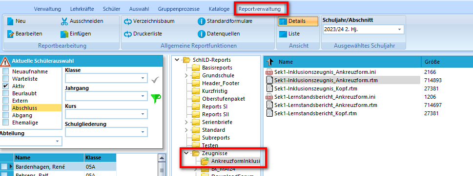

# Arbeitsverzeichnis
Bei der Installation wird eine SVWS-Arbeitsverzeichnis angelegt, in dem sämtliche Nutzerdaten gespeichert werden. Hier liegen unter anderem:
* Reports
* Datenbanksicherungen
* Connection-Files
* ggf. die Dokumentenverwaltung
* Exporte

## :a: Aufgabe - Reports

1. **Aktualisieren Sie die Zeugnisreports!**

 ::: details
 * Laden Sie sich von der Homepage das für Ihre Schule passenende Zeugnispaket herunter: https://www.svws.nrw.de/download/schild-reports/zeugnisformulare
 * Legen Sie sich im SVWS-Arbeitsverzeichnis einen Ordner Zeugnis-xx-xx-2024 an.
 * Entpacken Sie das Zeugnispaket und speichern Sie dieses im zuvor angelegten Ordner. 
 :::

2. **Sichten Sie den Zeugnisreport über SchILD-NRW3**

::: details
+ welchseln Sie in den Reiter Reportverwaltung
+ Navigieren Sie in den entsprechenden Zeugnisordner
+ Dort sollten die Reports nun sichtbar sein 
  
:::
     
::: info 
:exclamation: Die Nutzung von Reports ist nur über das Programm Schild-NRW3 möglich.
:::

## :a: Aufgabe - Dokumentenverzeichnis anlegen

Legen Sie eine Dokumentenverwaltung mit Hilfe von SchILD-NRW3 an (Unter Verwaltung/Einstellungen) 

::: details
+ Es wird empfohlen, das Arbeitsverzeichnis für die Dokumentenverwaltung zu nutzen.\
 
+ Informationen zu den Einstellungen finden Sie [hier](https://schulverwaltungsinfos.nrw.de/svws/wiki/index.php?title=Reports_verwenden_(Einf%C3%BChrung_in_SchILD-NRW)#Dokumenten-_und_Zeugnisarchivierung). Bei den Einstellungen gab es keine Änderungen im Vergleich zu SchILD-NRW2 
:::

::: info 
:exclamation: Die Aktivierung und Verwaltung von Dokumenten ist derzeit nicht über den Browser realisierbar.
:::

